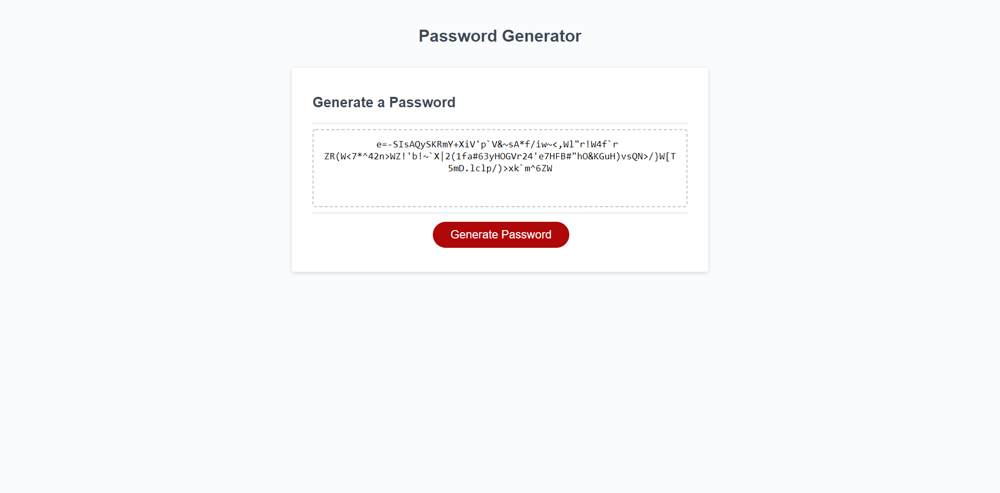

# Password-Generator

Page using javascript to generate random passwords

## Github Repo Link

https://github.com/palmersola/Password-Generator

## Deployed Application Link

https://palmersola.github.io/Password-Generator/

## Additions

A random number generater was used to select random characters from a set to create a random password

A character set function allows the user to select which set(s) of characters to add to the generator

A length function was added to pick an amount of characters between 8 and 128

If no character sets are selected, the user is notified and the program resets

If the length selected is not within the set parameters, the program resets

## Screenshot of Deployed Application

